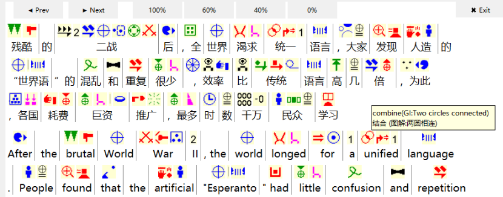
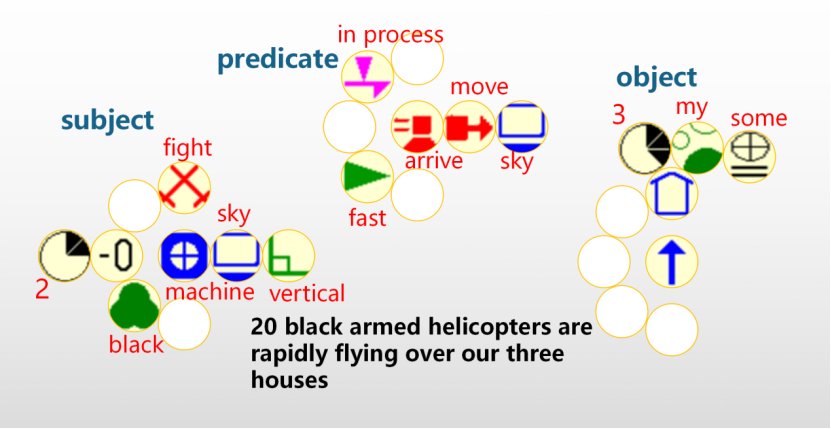
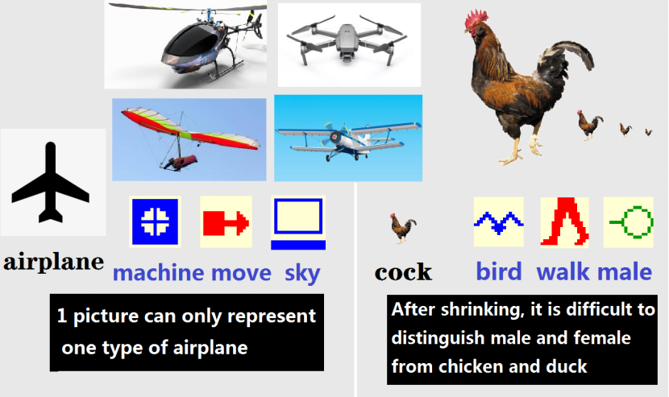
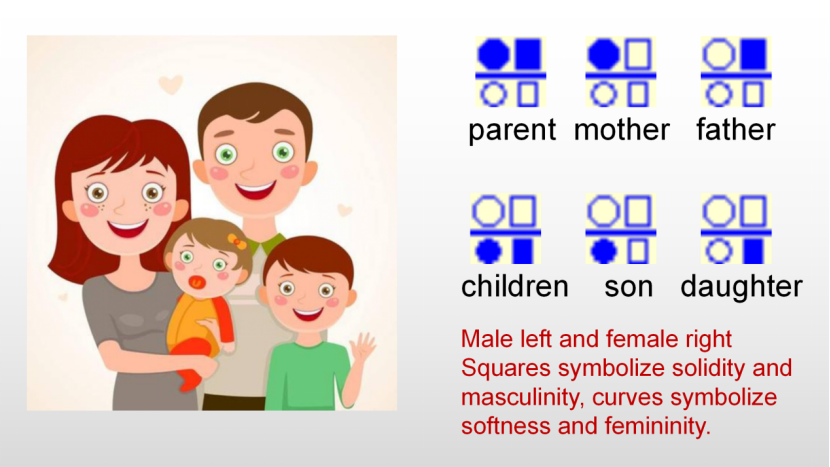
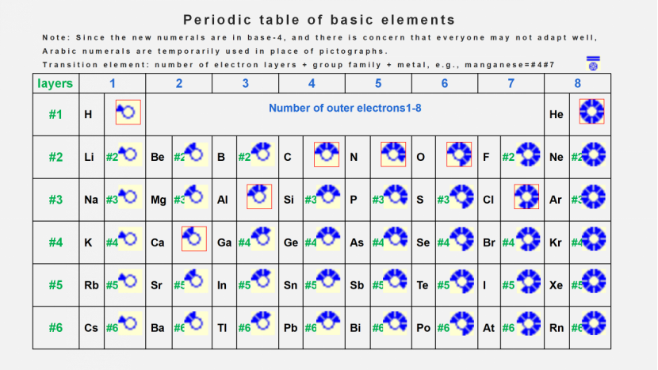

# World Glyph Alphabet (WGA)
WGA is a graphic symbol system designed globally. It enables cross - language communication and assists foreign - language reading without prior learning.

   

## Project Introduction
WGA has 600+. Each corresponds to a basic meaning; other meanings are expressed through combinations of multiple WGAs. For example:
*  Platform+Sleep → Bed   (core word on the left)
*  Grass+close+bug → Flytrap  (Even for region-specific plant, global users instantly grasp its category (grass) and key trait (traps bugs)).

The WGA reader intelligently matches WGAs above the text, allowing annotations to be viewed via mouse. Without prior learning, it can achieve bidirectional auxiliary understanding of text and WGAs. Applicable to:
* Reading foreign languages ★
* Reading ancient texts and technical terms
* Children's literacy
* Communication for the hearing impaired

## Core Advantage 1: Flexibility and Freedom
Graphics offer immense variability, ensuring high flexibility
1. Open design, continuous evolution
Unlike language pronunciation, WGA shape don't restrict each other. So anyone's ideas (shapes, word combinations, rules, etc.) can be discovered and promoted by the community.
2. Flexible layout
* Text-aligned layout (implemented): see WGA reader. 
* 2D layout (In Development): Logic-based layout breaks word order constraints, enabling instant page perception and parallel thinking.

## Core Advantage 2: Simple and Efficient 
Semantic decomposition makes WGAs concise, universal, abstract, and unambiguous.
1. Precise expression
Example: "舅舅"  as "uncle" is imprecise; "Brother + Mother" is exact.
2. Easy to understand
even for unfamiliar words, you can understand their categories and main characteristics via WGAs combinations.
3. Concise & Memorable
With only 600+, the shape can be simplified. 
① Easy to identify: small shape, faster reading

② Associative memory: Thanks to its simple shape, WGAs of the same type are more similar.

4. Simple & Fast Input
Input via categorized WGA search. Operable even by children. Average keystrokes < 20% of typing English.
Example (enter "mother"): Long press "person" → display secondary words → click "mother" with another finger. (Or long press "Mother" → display third level words and associated words)
## Core advantage 3: huge potential
For hundreds of thousands of years, the speed of human speech has hardly changed, and technological progress has made graphics have unlimited potential.
1. Physiological advantages
People's visual nerve is thousands of times that of hearing, and processing "graphics" information is much faster than "language", which is proved by the fact that mental arithmetic experts can be thousands of times faster.
2. Technical advantages
Graphic input grows ever easier. In the future, sensors will capture changes in hundreds of body parts, creating astronomical combinations. This may allow body - based input hundreds of times faster than speech.
3. Proven Effectiveness
① Global Success: Arabic numerals, punctuation, road signs, and icons transcend language barriers, boosting global communication and cognitive efficiency.
② Partial Success: Slightly graphic Chinese characters facilitate cross-language use. Printing/computing mitigated their "difficulty to write," enhancing efficiency.
Among the 117 most populous regions, the top six growth rates of GDP per capita (1960 - 2021) are Korea (used pre - 1980s), Taiwan, Singapore, China, Hong Kong, and Japan. These regions all use Chinese characters.
##Quick Start: Using WGA Reader
Installation steps……
Usage:
Select your native language (top right) → Enter or paste any - language text in the input box → Click "Start parsing". Then, the text and WGAs display side - by - side in seconds.
Query function: 
 Hover over a word: Shows its annotation.
 Hover over a WGA: Shows its meaning and design rationale.
Usage suggestion: 
Beginners: Focus on text, peripherally perceiving WGAs to build associations.
Advanced Users: Use the "X%" button to mask the lower half of the text, shifting focus to WGAs for graphic thinking training.

##Contribution Guide
The WGA project is crucial for human peace and development and urgently requires global collaboration. We invite enthusiasts in the following areas:

### 1. program development
 ① Optimize WGA Reader: Enhance parsing speed, accuracy, UX. \[Requirements Doc #\] \[Code Repo #\]
② Develop WGA Platform & Input Methods (Keyboard/Touch). \[Requirements Doc #\]
③ Build Browser Extensions for web page WGA display (Next Phase).
④ Explore 2D layout (Discussion Stage)
### 2. WGA shape design 
Design more intuitive, memorable, and recognizable shapes for the 600+ WGAs.Single WGA submissions are accepted. \[Download Existing WGA #\]
### 3. Phrase design (Need lovers from all languages and fields.)
Create concise, easy-to-understand, unambiguous WGAs combinations for tens of thousands of words.  Submit solutions for individual words.  [Word Bank Decomposition Table #]  
### 4. Other Contributions
*   Translation
*   Grammar Design
*   WGA Set Expansion/Reduction
*   2D layout Design
*   Experimental Proposals
*   Community Governance
We welcome your suggestions and participation!

## Contact & Feedback
* Community Discussion: \[Community Link #\]
* Email: wga.open@gmail.com

## License
This project is licensed under the MIT License. See the LICENSE file in the project root for details.
