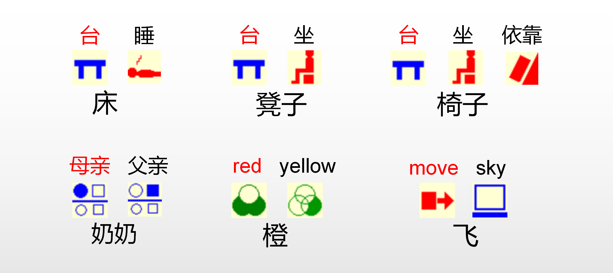
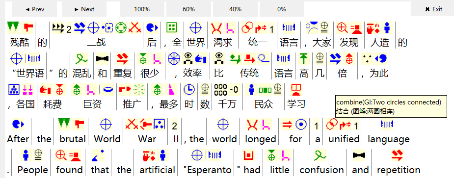
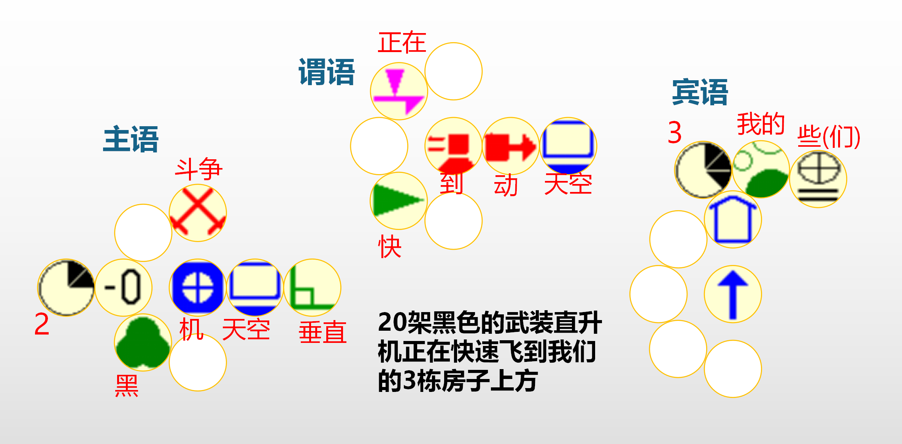
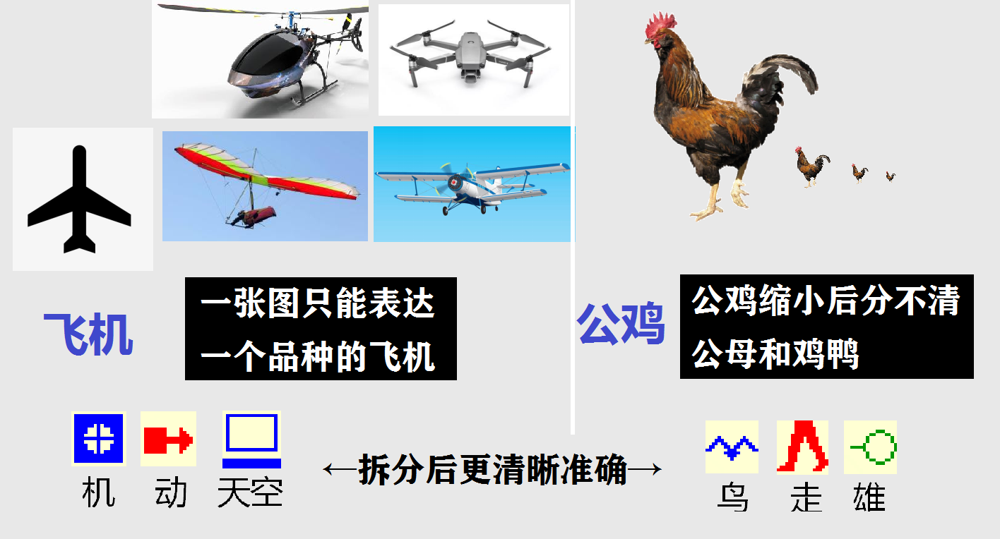
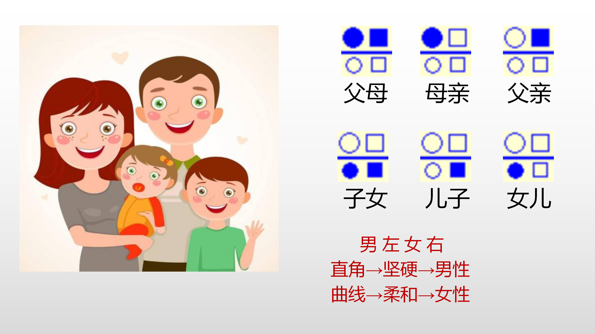

# 世界图形字母（World Glyph Alphabet-WGA，简称图母）
图母是一种由多国设计的图形符号，无需预先学习，通过图形组合实现跨语言交流和辅助阅读外文。

[](README.md) []() [](./LICENSE) []()
## 项目简介
图母共600+，分别对应一个基础词义，其他词义由多个图母组合来表达，例如：
* 台+睡→床  （左侧为核心词）
* 草+关+虫→Flytrap：即使该植物为某地特有，也能让全球用户了解它的类别（草）和主要特性（关住虫子）。


图母阅读器在文本上方智能匹配图母，鼠标可查注解，无需预先学习，就能实现文字与图母双向辅助理解。适用于：
* 阅读外文★
* 阅读古文和专业术语
* 儿童识字
* 听障人士沟通


## 核心优势一：灵活自由
与语言不同的是，图形可变空间巨大，因而高度灵活。
1. 开放设计，持续进化
WGA不像语言的发音那样会互相限制，因此任何人的创意（形状、组词、规则等）都有机会被社区发现和推广。
2. 灵活排列
*  跟随排列（已实现）：见图母阅读器。
*  二维排列（开发中）：按逻辑关系布局，突破语序限制，支持整页内容的瞬间感知与并行思考。


## 核心优势二：简单高效
词义拆解，使图母更加简明、通用、抽象且无歧义。
1. 表达精准
例如：“舅舅”译为“uncle”不够精确，“兄弟+母亲”则表达精准。
2. 易于理解
即使是生词，也可以通过图母组合了解其类别和主要特性。
3. 简洁易记
仅有600+，因而可简化形状。
① 容易辨识：形状小，阅读更快

② 联想记忆：因形状简单，同类图母更相似。



4. 输入简单、快速
分类选图即可输入，幼儿也可操作，平均按键次数低于英文输入的20%。
示例（输入“母亲”）：长按“人”→显示二级词→另一手指点“母亲”。（或长按“母亲”→显示三级词和联想词）
## 核心优势三：潜力巨大
数十万年来人类语速几乎未变，而技术进步让图形潜力无穷。
1. 生理优势
人的视觉神经为听觉的数千倍，处理“图形”信息远快于“语言”，心算高手能快千倍就是证明。
2. 技术优势
输入图形日益便捷，未来传感器能捕捉全身几百处的变化，其组合是天文数字，全身打字有望比说话快数百倍。
3. 成功例证
① 全球通用：阿拉伯数字、标点、路标、图标等，已突破语言壁垒，显著提升了全球交流与思维效率。
② 部分通用：汉字略像图形，可跨语言使用。印刷和电脑技术弥补了其“难写”缺陷，提高了效率。
在人口最多的117个地区中，1960-2021年间人均GDP增速前六名均为汉字地区：韩国（1980年代前用汉字）、中国台湾、新加坡、中国、中国香港、日本。

## 技术架构

### 核心组件

1. **界面管理器 (`ui_manager.py`)**
   - 处理所有界面相关功能
   - 管理语言切换
   - 创建和维护应用程序窗口
   - 实现响应式布局

2. **文本处理器 (`deepseek_module.py`)**
   - 集成 DeepSeek AI 进行文本分析
   - 处理文本分块和处理
   - 管理 API 通信和响应解析

3. **数据处理器 (`data_processor.py`)**
   - 处理和分析文本标记
   - 管理分词
   - 处理词库匹配和优化

4. **图像加载器 (`image_loader.py`)**
   - 管理图像加载和缓存
   - 处理图像调整大小和优化
   - 提供图像到文本的关联

5. **翻译服务 (`Baidu_Text_transAPI.py`)**
   - 集成百度翻译 API
   - 处理多语言翻译
   - 管理 API 认证和请求

6. **词库管理器 (`lexicon_manager.py`)**
   - 管理词汇数据库
   - 处理词汇图像关联
   - 优化词库加载和缓存

7. **分页管理器 (`pagination.py`)**
   - 处理内容分页
   - 管理页面渲染
   - 实现滚动功能

## 安装说明
### 方式一
直接通过release下载预编译好的可执行文件，无需安装Python环境。


### 方式二
从源代码进行安装
1. **环境要求**
   ```bash
   Python 3.7+
   pip install requests jieba pillow pandas
   ```

2. **配置**
   - 在 `Baidu_Text_transAPI.py` 中设置百度翻译 API 凭证
   - 在 `deepseek_module.py` 中配置 DeepSeek API 密钥
   - 确保所需图像资源位于 `TU` 目录中
   - 将词库数据放在 `KU.csv` 中

3. **运行应用**
   ```bash
   python main.py
   ```

## 使用说明

1. **文本输入**
   - 在输入框中输入文本（最多1000字符）
   - 从下拉菜单中选择所需语言
   - 点击"开始处理"

2. **查看结果**
   - 使用导航按钮在页面间移动
   - 使用百分比按钮调整显示比例
   - 悬停在文本上查看附加信息
   - 查看与文本关联的图像

3. **语言切换**
   - 从下拉菜单中选择语言
   - 文本和界面将自动更新
   - 翻译实时处理


## 快速开始：使用图母阅读器
使用方法：
右上角选择母语→在输入框输入或粘贴任意语言文本→点“开始解析”→数秒后文本与图母将并排显示。
查询功能：
・ 鼠标悬停文字上方：显示词汇的注解。
・ 鼠标悬停图母上方：显示图母含义及设计思路。
使用建议：
・ 初期阶段：主要阅读文字，用余光感知图母，逐步建立关联。
・ 熟练阶段：点“X%”按钮遮盖文字下半部分，将注意力转向图母，训练图形思维。
## 贡献指南
图母项目关乎人类和平与发展，亟需全球协作。我们诚邀以下领域的爱好者参与：
### 1. 程序开发
① 优化图母阅读器：提升解析速度、准确率与用户体验。[需求文档链接](doc/图母阅读器修改需求.md)
② 开发图母交流平台和输入法（键盘与触屏）[需求文档链接](doc/图母平台与输入法.docx)
③ 研发图母浏览器插件（下一阶段）
④ 探索二维排列模式（讨论阶段）
### 2. 图母形状设计
为600+图母寻找更易理解、记忆和辨识的形状设计。可提交单个图母的设计。[现有图母PNG下载链接](src/TU(1).rar)
### 3. 词组设计（亟需各语言、各领域爱好者！）
为上万词义寻找简洁、易懂、无歧义的图母组合方案。可提交单个词的方案。[词库拆解表下载链接](src/WGA-word.xlsx)
### 4. 其他贡献方向
* 翻译
* 语法设计
* 图母的增减
* 二维排列设计
* 实验方案
* 社区管理机制
期待您的建议与参与！
## 联系与反馈
* 社区讨论：[图母社区](https://github.com/World-Graphic-Alphabet-WGA)
* 邮箱：sjtxzxx@gmail.com  
## 许可证
本项目采用 MIT 开源许可证，详情见项目根目录下的 LICENSE 文件。	
